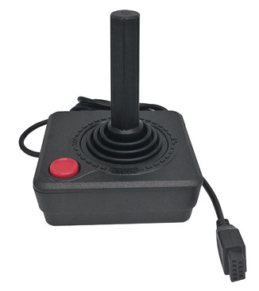

# PicoGAME VGA
**Unofficial FAQ and repository of PicoGAME VGA goodness**

## What is a PicoGAME VGA ?

The PicoGAME VGA is a hardware variant of the [PicoMiteVGA](https://geoffg.net/picomitevga.html) a "Raspberry Pi Pico with VGA output, PS2 keyboard input, SD card storage and running the free MMBasic interpreter."

Its main point of differentiation from the PicoMiteVGA reference design is that it comes with a standardised game controller configuration consisting of a pair of male DB-9/DE-9 ports (A & B) that can accept either NES/Famicom clone gamepads or Atari style joysticks (or one of each)*. Alternatively controller port B can accept a Null modem cable allowing two PicoGAME VGAs to be linked together.

*\* There are also analogue controller options but these require original retro or homebrew controllers, there are no new off-the-shelf compatible devices.*

## Who designed it ?

The PicoGAME VGA was designed by Mick Ames (@Mixtel90) with encouragement from the cheap seats by Tom Williams (@thwill). It is based on the PicoMiteVGA reference design by Peter Mather (@matherp) and runs the standard PicoMiteVGA firmware by Geoff Graham (@GeoffG) and Peter Mather:

 

## Where can I get one ?

For the moment you have to order the PCBs and components and solder it up for yourself.
  
The construction pack containing Gerbers for the PCB and construction notes including a bill of materials (BOM) for the latest version can be found [here](hardware/v14a).

The PCBs can be fabricated inexpensively by [JLPCB](https://jlcpcb.com/) or other fabricators; if you choose the cheapest shipping option they should cost < £10 for 5.

Suggested sources for components are given in the BOM, or to save a few pennies they can be ordered from eBay or AliExpress.

## What gamepads can I use ?

The PicoGAME is compatible with NES/Famicom "clone" gamepads with female DB-9/DE-9 plugs as shown below:
  

Notes:
 1. Though they appear to have 4 fire-buttons these gamepads really only have 2: A & B. The other two are the "autofire/turbo" buttons and just simulate A or B being rapidly and repeatedly pressed.
 2. Make sure you get gamepads with 9-pin female DB-9/DE-9 plugs, not ones with the official NES 7-pin plug or those with USB-A connectors designed for use with modern PCs.

They can be obtained from the following AliExpress vendors - **these are just examples, not affiliate links and I take no responsibility for the quality of the goods:**

 - https://www.aliexpress.com/item/32919127872.html
 - https://www.aliexpress.com/item/32803427153.html
 - and many others.

## What joysticks can I use ?

The PicoGAME is compatible with Atari style single-button digital joysticks with female DB-9/DE-9 plugs as shown below:
  

They can be obtained from the following eBay and AliExpress vendors - **these are just examples, not affiliate links and I take no responsibility for the quality of the goods:**

 - https://www.ebay.co.uk/itm/194000895590
 - https://www.aliexpress.com/item/1005003590552924.html
 - and many others.

## Is there a Wiki ?
  
Yes, there is, it's [here](https://github.com/thwill1000/pico-game-vga/wiki).

## Is there an online community ?

@Mixtel90 and @thwill can be found hanging out in [The Back Shed](https://www.thebackshed.com/forum/ViewForum.php?FID=16) forum where there is a [long running thread](https://www.thebackshed.com/forum/ViewTopic.php?FID=16&TID=14670) on the PicoGAME VGA, take care not to get confused by comments referring to earlier revisions of the PCB.

@GeoffG and @matherp are there too, but they are not to blame for the PicoGAME!
