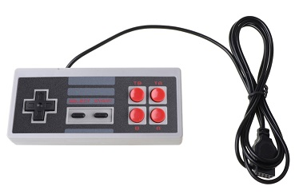

# PicoGAME VGA
**Unofficial FAQ and repository of PicoGAME VGA goodness**

## What is a PicoGAME VGA ?

The PicoGAME VGA is a hardware variant of the [PicoMiteVGA](https://geoffg.net/picomitevga.html) a "Raspberry Pi Pico with VGA output, PS2 keyboard input, SD card storage and running the free MMBasic interpreter."

Its main point of differentiation from the PicoMiteVGA reference design is that it comes with a standardised game controller configuration consisting of a pair of male DB-9/DE-9 ports (A & B) that can accept either NES/Famicom clone gamepads or Atari style joysticks (or one of each). Alternatively controller port B can accept a Null modem cable allowing two PicoGAME VGAs to be linked together*.

## Who designed it ?

The PicoGAME VGA was designed by Mick Ames (@Mixtel90) with encouragement from the cheap seats by Tom Williams (@thwill). It is based on the PicoMiteVGA reference design by Peter Mather (@matherp) and runs the standard PicoMiteVGA firmware by Geoff Graham and Peter Mather:

<Screenshot>

## Where can I get one ?

## What gamepads can I use ?

The PicoGAME is compatible with NES/Famicom "clone" gamepads with female DB-9/DE-9 plugs as shown below:
  

Notes:
 1. Though they appear to have 4 fire-buttons these gamepads really only have 2: A & B. The other two are the "autofire/turbo" buttons and just simulate A or B being rapidly and repeatedly pressed.
 2. Make sure you get gamepads with 9-pin female DB-9/DE-9 plugs, not ones with the official NES 7-pin plug or those with USB-A connectors designed to use with modern PCs.
  
## What joysticks can I use ?

The PicoGAME is compatible with Atari style single-button digital joysticks with female DB-9/DE-9 plugs as shown below:
  

## Is there a Wiki ?
  
Yes, there is, it's [here](https://github.com/thwill1000/pico-game-vga/wiki).
